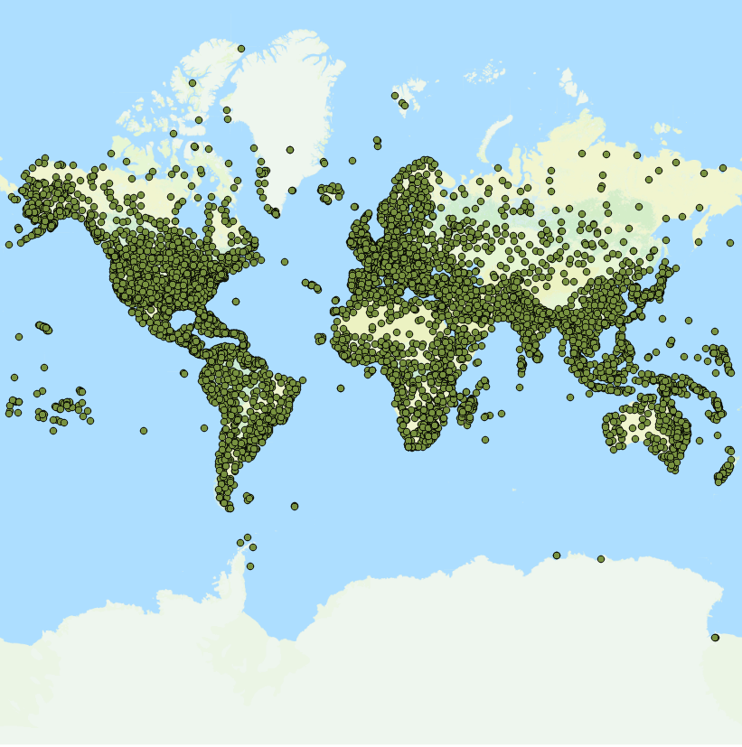

# Exercise 04: Geospatial Data Munging with Python

**GIS 321: Principles of Programming for GIScience**  
**Instructor: Dr. Sergio Rey**

In this exercise you will apply some of the Python core data types, control structures and file operations we have explored in class.

You will be working on the [airports.csv](airports.csv) dataset we introduced in [exercise 2][e2]. Only now you will use Python to complete the following analyses.

1. Find the western most airport in the northern hemisphere
2. Find the western most airport in the southern hemisphere
3. Find the southern most airport in the western hemisphere
4. Find the northern most airport in the eastern hemisphere

Submit your finshed, and fully commented, Jupyter notebook as a pull request to the collaboratory repository on GitHub.

*Hints:* You should revisit the lecture notebooks on [dictionaries][dict] and [contolled execution][cond] for ideas on how to implement your solutoins.

[e2]: https://github.com/sjsrey/gis321f16collaboratory/blob/master/exercise02/exercise02.md
[dict]: https://github.com/sjsrey/gis321f16/blob/master/content/partI/lect_dict.ipynb
[cond]: https://github.com/sjsrey/gis321f16/blob/master/content/partI/lect_conditionals.ipynb
