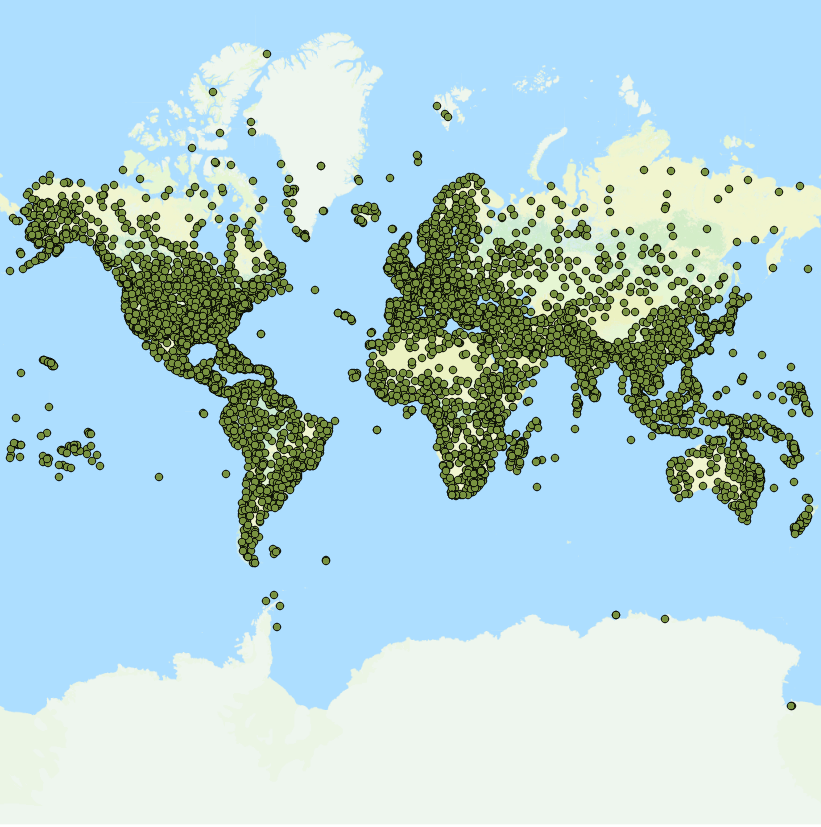

# Exercise 06: Geospatial Indexing with Python

**GIS 321: Principles of Programming for GIScience**  
**Instructor: Dr. Sergio Rey**

In this exercise you will extend our points module to include distance based functions to carry out some analysis of the point pattern distribution.

You will be working on the [airports.csv](airports.csv) dataset we introduced in [exercise 2][e2] along with the [countries.geojson](https://github.com/datasets/geo-countries/tree/master/data) file.

1. Create a new class called Feature. For each feature in the countries file create an instance of your Feature class.
2. Add a minimum bounding rectangle (MBR) attribute to your Feature class
3. Add a method to determine whether a point (lon, lat) is contained in the Feature's MBR.
4. For each feature add a new attribute that lists the airports contained in its MBR.

Submit your finished, and fully commented, Jupyter notebook as a pull request to the collaboratory repository on GitHub.

[e2]: https://github.com/sjsrey/gis321f16collaboratory/blob/master/exercise02/exercise02.md
[functions]: https://github.com/sjsrey/gis321f16/blob/master/content/partI/lecture_functions.ipynb
[modules]: https://github.com/sjsrey/gis321f16/blob/master/content/partI/lecture_modules.ipynb
