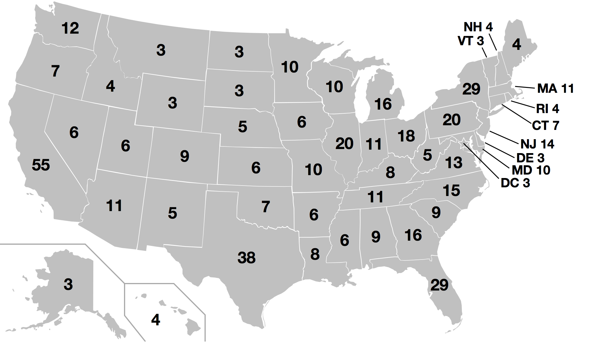

# Exercise 7: Discrete Markov Chains

(Source: https://upload.wikimedia.org/wikipedia/commons/e/ec/ElectoralCollege2016.svg)

## Instructions

Required Reading: Explore the implementation of [Discrete Markov Chains using NumPy](http://www.scipy-lectures.org/intro/numpy/exercises.html#array-manipulations).

Optional Reading: [PySAL Markov Chain Implementation](http://pysal.readthedocs.io/en/latest/users/tutorials/dynamics.html#markov-based-methods)

Using the data for [Presidential Elections from 1972-2012](https://en.wikipedia.org/wiki/List_of_United_States_presidential_election_results_by_state) complete the following tasks:

1. Estimate a two-state discrete Markov chain (with the states being Democrat and Republican).

2. Estimate the steady-state distribution for the chain.

3. Use the 2012 observations by state together with your estimated chain and the [electoral votes for each state](http://state.1keydata.com/state-electoral-votes.php) to predict the 2016 election. Run 100 simulated elections. What is the share of elections won by the Democrat?

Assumptions:

- All US states follow the same chain
- All US states are independent of their neighbors

(Later on we will explore relaxing these assumptions.)
